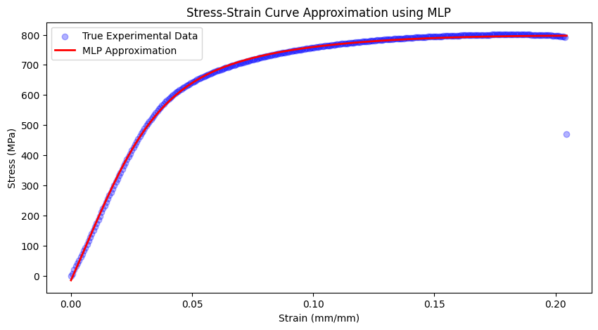
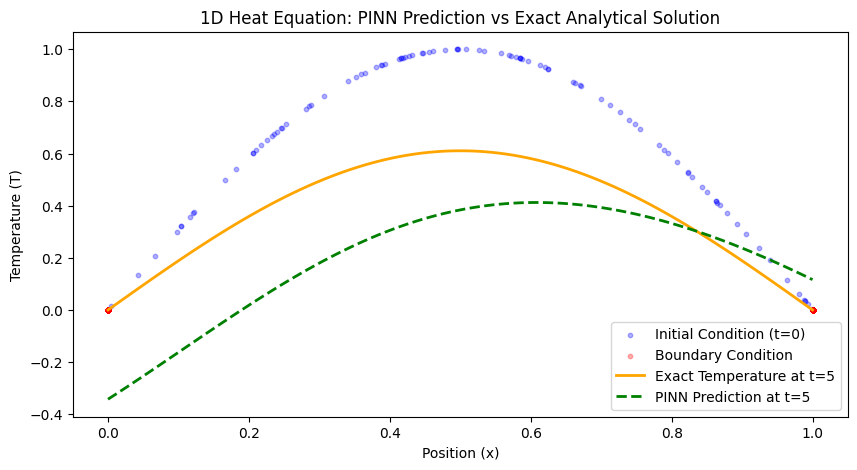

# Scientific Machine Learning (SciML) Portfolio

This repository demonstrates my transition from traditional computational mechanics to physics-based deep learning. It contains implementations of neural networks enforcing physical laws (PINNs) and infinite-dimensional neural operators (FNOs/PINOs).

## 🚀 Projects Included

### 1. Data-Driven Hyperelasticity (MLP)
* **Objective:** Predict a non-linear stress-strain curve from noisy experimental brass tensile data.
* **Key Skills:** PyTorch dataset normalization, multi-layer perceptrons, and inverse physical scaling.
* **Run it:** `python scripts/nn_basics.py`

 **

### 2. 1D Transient Heat Conduction (PINN)
* **Objective:** Solve the heat equation ($\frac{\partial T}{\partial t} = \alpha \frac{\partial^2 T}{\partial x^2}$) without a mesh, using autograd for exact spatial and temporal derivatives.
* **Key Skills:** Physics-Informed Neural Networks, PyTorch Autograd (`create_graph=True`), Collocation point sampling.
* **Run it:** `python scripts/pinn_heat.py`
**

### 3. 2D Darcy Flow (Fourier Neural Operator)
* **Objective:** Learn the continuous mapping from a 2D permeability field to a fluid pressure field in the frequency domain.
* **Key Skills:** Spectral Convolution, FFTs, Zero-Shot Super Resolution (scaling weights from $32 \times 32$ to $128 \times 128$ without retraining).
* **Run it:** `python scripts/fno_darcy.py` (Note: This script runs a standalone Zero-Shot Super Resolution tensor test to prove resolution invariance).
**
### 4. 1D Burgers' Equation (PINO)
* **Objective:** Guide an FNO with physics losses in the low-data regime using CFD stencils.
* **Key Skills:** Physics-Informed Neural Operators, freezing Conv1d layers to act as finite difference stencils.
* **Run it:** `python scripts/pino_burgers.py`

## ⚙️ Installation & Usage
To reproduce these results on your local machine:
1. Clone the repository: `git clone https://github.com/Mousa-sarhani/SciML-Portfolio.git`
2. Install dependencies: `pip install -r requirements.txt`
3. Execute any script in the `scripts/` directory.